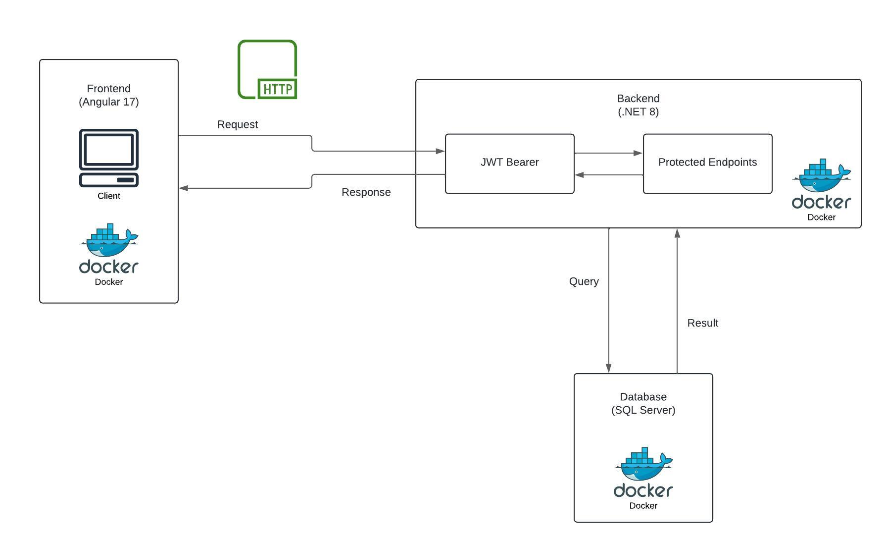

# Sistema de gestion de PDFs

## Tabla de Contenidos
1. [Descripción](#descripción)
2. [Pre-requisitos](#pre-requisitos)
3. [Instalación](#instalación)
4. [Ejecución](#ejecución)
5. [Acceso a la Aplicación](#acceso-a-la-aplicación)
6. [Tecnologías](#tecnologías)
7. [Documentación Técnica](#documentación-técnica)


## Descripción

El sistema de gestión de PDFs es una solución integral que permite a los usuarios gestionar archivos PDF de manera eficiente. Entre las principales características están:

- **Subir**: Permite a los usuarios cargar archivos PDF al sistema.
- **Descargar**: Facilita la descarga de PDFs previamente cargados.
- **Firmar**: Permite la firma digital de PDFs.
- **Eliminar**: Opción para borrar archivos PDF que ya no sean necesarios.

Este proyecto está construido utilizando tecnologías modernas como **Angular** para el frontend, **.NET** para la API backend, y **SQL Server** para el almacenamiento de datos. Todo el sistema se ejecuta dentro de contenedores **Docker**, lo que simplifica la configuración y el despliegue.


## Pre-requisitos

Para ejecutar este proyecto, usaremos Docker. Asegúrese de tener Docker instalado en su máquina. Puede descargar Docker Desktop desde [aquí](https://www.docker.com/products/docker-desktop).

## Instalación

### 1. Clonar el Repositorio

Abra la terminal o el símbolo del sistema y ejecute el siguiente comando:

```bash
git clone http://github.com/Milton090/pdfSystem.git
```

### 2. Configurar el Archivo `.env` (Opcional)

Si desea configurar variables de específicas para su entorno, puede hacerlo creando un archivo `.env` en la raíz del proyecto.

1. Navegue a la raíz del proyecto en su terminal o símbolo del sistema
    
    ```bash
    cd pdfSystem
    ```

2. Cree un archivo `.env` en la raíz del proyecto:

    #### Linux/macOS:

    ```bash
    touch .env
    ```

    #### Windows (PowerShell):

    ```powershell
    New-Item -Path .env -ItemType File
    ```

    #### Windows (CMD):

    ```cmd
    echo.> .env
    ```

3. Abra el archivo `.env` en su editor de texto y agregue las variables de entorno congifurables necesarias. Estas son las que puede incluir:

    ```env
    CLIENT_PORT=7000

    SERVER_PORT=5000
    JWT_SECRET=yourV3ryStr0ngJWT_S3cr3tK3yW1th32Chars!

    DB_PORT=6060
    SA_PASSWORD=yourSAPassword123!
    ```

    - SA_PASSWORD: Debe tener al menos 8 caracteres y contener al menos un número, una letra mayúscula, una letra minúscula y un carácter especial.
    - JWT_SECRET: Debe tener al menos 32 caracteres, esto debido al algoritmo de encriptación utilizado.

> **Nota:** Si no configura el archivo `.env`, se utilizarán los valores predeterminados del archivo `docker-compose.yml`. Solo modifique el archivo `.env` si desea cambiar los valores predeterminados en caso de un conflicto de puertos.

> **Importante:** Si configura o cambia la variable `SERVER_PORT` en el archivo `.env`, asegúrese de cambiar la variable `apiUrl` en el archivo `environment.ts` que se encuentra en el directorio `frontend/src/environment/` para que coincida con el puerto del servidor.

## Ejecución

Para ejecutar el proyecto, abra la terminal o el símbolo del sistema en la raíz del proyecto y ejecute el siguiente comando:

```bash
docker compose up
```
Este comando creará y ejecutará los contenedores de Docker para la aplicación web, la API y la base de datos. Puede tardar unos minutos en completarse la primera vez que se ejecuta.

## Acceso a la Aplicación
- **Frontend**: Visite `http://localhost:CLIENT_PORT/` (por defecto `7000`).
- **Backend API**: Pruebe la API en `http://localhost:SERVER_PORT/swagger/index.html` (por defecto `5000`).

## Tecnologías

- **Frontend**: Angular 17
- **Backend**: .NET 8
- **Base de datos**: SQL Server
- **Firma de PDFs**: iText7 con Bouncy Castle
- **Contenedores**: Docker


## Documentación Técnica

### 1. Decisiones Técnicas

#### Backend - .NET
El backend se desarrolló en **.NET 8**, en línea con los requisitos de la prueba técnica. A continuación se describen las librerías y tecnologías clave utilizadas:

- **iText7**: Esta biblioteca se seleccionó para la manipulación avanzada de documentos PDF, incluyendo la capacidad de firmar electrónicamente los archivos. 
- **BouncyCastle.NetCore**: Esta librería criptográfica se utilizó en conjunto con *iText7* para manejar certificados y algoritmos de firma digital. *BouncyCastle* es compatible con *.NET* y es fundamental para la correcta implementación de la firma digital mediante certificados.
- **Identity**: Se integró *Identity* para gestionar de manera segura la autenticación de usuarios. Esta herramienta permite registrar y autenticar usuarios de forma segura, y fue elegida por su fácil integración en el ecosistema *.NET*.
- **JWT Bearer**: Para la autorización, se implementó *JWT Bearer* con el fin de asegurar las rutas de la API mediante el uso de tokens *JWT*.
- **EntityFrameworkCore**: El ORM elegido fue EntityFrameworkCore, utilizado para gestionar las operaciones de la base de datos, como el almacenamiento de archivos PDF y la gestión de usuarios. Esto asegura un manejo eficiente de las interacciones con *SQL Server*, lo que simplifica la manipulación de datos complejos.
- **EntityFrameworkCore.SqlServer** y **EntityFrameworkCore.Tools**: Estas extensiones específicas para *SQL Server*  fueron esenciales para facilitar la integración con la base de datos y aprovechar las características avanzadas del motor SQL.

#### Frontend - Angular
El frontend fue desarrollado en **Angular 17**, en linea con los requisitos de la prueba técnica.

- **Servicios**: Los servicios de Angular se encargan de la comunicación con la API REST para subir, descargar, y firmar los archivos PDF.
- **Standalone Components**: Se emplearon componentes independientes, siguiendo el patrón más reciente de Angular.

### 2. Justificación de Herramientas

- **Docker**: La decisión de utilizar Docker se tomó para garantizar un entorno de desarrollo homogéneo. Docker permite empaquetar tanto el backend como el frontend en contenedores separados, lo que facilita el despliegue y asegura la escalabilidad. Además, asegura que las dependencias estén contenidas dentro de los contenedores, lo que evita conflictos entre entornos.
- **iText7 y BouncyCastle.NetCore**: Se seleccionaron estas librerías debido a su robustez y compatibilidad con *.NET*. *iText7* es ampliamente utilizado para la manipulación de PDFs, mientras que *BouncyCastle* es una de las bibliotecas más confiables para el manejo de algoritmos criptográficos en entornos *.NET*. En cuanto al certificado utilizado, se optó por un certificado autofirmado para simplificar la implementación y las pruebas.
- **Moq y xUnit**: Para las pruebas unitarias, se optó por *xUnit* como framework de testing debido a su capacidad para gestionar pruebas de manera eficiente en entornos *.NET*. *Moq* fue seleccionado para crear mocks y simular dependencias, lo que facilita las pruebas aisladas de componentes individuales.

### 3. Patrones de Diseño

- **Repository Pattern**: El patrón de repositorio fue implementado en el backend para desacoplar la lógica de acceso a datos del resto de la aplicación. Esto permite que la capa de datos sea más fácil de probar y mantener.
- **Dependency Injection**: Utilizado para gestionar las dependencias dentro del proyecto, lo que facilita la modularidad y la realización de pruebas unitarias.
- **JWT para Autenticación y Autorización**: Se eligió *JWT* para manejar la autenticación basada en tokens. Esta técnica es ligera y se ajusta a la arquitectura sin necesidad de manejar sesiones en el servidor, lo que mejora la escalabilidad del sistema.

### 4. Pruebas Unitarias y de Integración

Las pruebas unitarias y de integración son una parte fundamental de este proyecto, garantizando que el sistema funcione correctamente bajo distintas condiciones.

- **xUnit** se utilizó para las pruebas unitarias debido a su integración nativa con .NET y su capacidad de estructurar y ejecutar las pruebas de manera eficiente.

- **Moq** fue utilizado para simular dependencias y evitar la necesidad de interactuar con bases de datos reales o servicios externos durante las pruebas. Esto permite validar el comportamiento de la lógica del sistema de manera aislada.

### 5. Estrucutra del Proyecto

El proyecto se estructura en tres componentes principales: el frontend, el backend y la base de datos. Cada uno de estos componentes se encuentra en un directorio separado y se despliega en un contenedor Docker independiente.

#### Frontend (`frontend/`)

- **src/**: Contiene el código fuente de la aplicación Angular.
  - **app/**: Aquí se encuentran los componentes, servicios y módulos de la aplicación.
  - **assets/**: Archivos estáticos como imágenes y estilos CSS.
  - **environment/**: Configuraciones específicas de entorno (por ejemplo, desarrollo y producción).

#### Backend (`backend/PdfSystem/`)

- **Controllers/**: Contiene los controladores que gestionan las solicitudes de la API.
- **Models/**: Aquí se definen los modelos de datos que representan las entidades de la aplicación.
- **Repositories/**: Implementaciones del patrón repositorio para el acceso a la base de datos.
- **Services/**: Lógica de negocio que interactúa con los modelos y repositorios.

#### Backend Testing (`backend/PdfSystemTest/`)

- **Services/**: Pruebas de los servicios de la aplicación.
- **Controllers/**: Pruebas de los controladores de la aplicación.


#### Ejecución de Pruebas
Las pruebas están integradas en el proceso de construcción de la imagen Docker. Durante la fase de compilación (build), las pruebas del proyecto PdfSystemTest se ejecutan automáticamente utilizando el siguiente comando:

```dockerfile
RUN dotnet test "PdfSystemTest.csproj" -c Release -o /app/test
```
Este comando, se asegura que las pruebas unitarias sean ejecutadas antes de que la aplicación se despliegue, garantizando que cualquier error sea detectado a tiempo y no afecte al entorno de producción.


### Evaluación de Requisitos Adicionales

Durante el desarrollo de la aplicación, se identifican requisitos adicionales que mejoran su funcionalidad. A continuación, se presentan algunos de estos requisitos y cómo se podría adaptar el diseño para cumplirlos:

1. **Gestión de Versiones de PDF**:
   - **Requisito**: Permitir que los usuarios mantengan múltiples versiones de un mismo PDF.
   - **Adaptación**: 
     - Modificar el modelo `Pdf` para incluir un campo `Version` que registre la versión del archivo.
     - Implementar una lógica que permita a los usuarios subir nuevas versiones y mantener un historial de versiones para cada PDF.

2. **Reportes de Actividad**:
   - **Requisito**: Generar reportes sobre la actividad de los usuarios en la plataforma.
   - **Adaptación**: 
     - Desarrollar un servicio que compile datos de uso y genere reportes en formatos como PDF o CSV.
     - Implementar un endpoint que permita a los usuarios descargar estos reportes.

3. **Integración con Servicios Externos en la Nube**:
   - **Requisito**: Permitir el almacenamiento de PDFs en plataformas de almacenamiento en la nube.
   - **Adaptación**: 
     - Implementar una interfaz para la integración con servicios como AWS S3 o Google Cloud Storage.
     - Modificar el proceso de carga de archivos para almacenar los PDFs directamente en la nube y guardar la URL en la base de datos.

4. **Mejora de la Interfaz de Usuario (UI)**:
   - **Requisito**: Mejorar la experiencia del usuario con una interfaz más amigable y accesible.
   - **Adaptación**: 
     - Realizar pruebas de usabilidad para identificar áreas de mejora en la interfaz.


### Diagrama de Arquitectura

El siguiente diagrama muestra la arquitectura general de la aplicación, incluyendo los componentes principales y cómo interactúan entre sí:




## Conclusiones

El desarrollo de este sistema de gestión de PDFs ha sido una experiencia enriquecedora que me ha permitido aplicar mis conocimientos en tecnologías modernas y buenas prácticas de desarrollo. A lo largo del proyecto, he podido implementar funcionalidades clave, como la carga y descarga de archivos PDF, la firma digital y la autenticación de usuarios. Además, he integrado tecnologías como Angular, .NET y SQL Server, lo que me ha permitido crear una aplicación robusta y escalable. Tambien he afirmado mis conocimientos en Docker, lo que me ha permitido desplegar la aplicación de manera sencilla y eficiente.